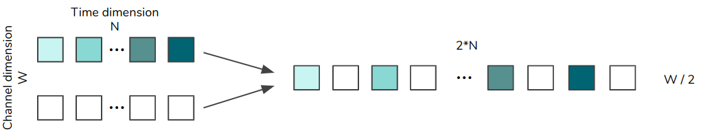

Semester Project by [Loïs Bilat](mailto:lois@bilat.xyz) at VITA Lab - EPFL - Fall 2019 

Supervised by [Alexandre Alahi](mailto:alexandre.alahi@epfl.ch) and [Brian Sifringer](mailto:brian.sifringer@epfl.ch).

You can take a look at the [introduction presentation](pdf/vita/presentation_intro.pdf), the [midterm presentation](pdf/vita/presentation_midterm.pdf) and the [final presentation](pdf/vita/presentation_final.pdf).

# Table of Contents
1. [Introduction](#introduction_)
2. [Model](#model_)
	- [Original Architecture](#original_model_)
    - [GAN](#gan_)
    - [Auto-encoder](#autoencoder_)
    - [Collaborative GAN](#collaborative_gan_)
    - [Conditional GAN](#conditional_gan_)
3. [Code](#code_)
4. [Experiments](#experiments_) 
5. [Discussion](#discussion_) 
6. [Conclusion](#conclusion_) 
7. [Sources](#sources_) 

<a name="introduction_"></a>


# Introduction

**Description of the problem**

The quality of audio recordings from a mobile device has gotten better over the years, but there are still a lot of factors that can decrease the quality. Among others, the size and the quality of the microphone sensor, as well as its location relative to the audio source can have a non negligable impact. We also cannot forget potential ambient noise (e.g. voices, rain, traffic) and reverberation that can be caused by the size and shape of the room.

It would be useful if we could somehow correct all those issues by using software tools that could take a low quality audio file, and improve it as if the audio was recorded using high quality equipment in a perfectly silent environment. More precisely, given a music sample of any length and recorded using low quality equipment in a noisy environment (therefore it might have a low resolution, some noise and some reverberation), we want to output a higher resolution version of the same audio sample, with some of the noise and reverberation removed. If the resulting music file sounds better to the human ear than the original, the transformation is considered successful. 

**Why is it important ?**

If we want high-quality recording on our mobile devices, we need some software solutions, as we might not be able to improve the hardware quality of the microphone due to physical limitations. It is also hard to control the environment where we want to do our recording. This type of technology could then be used by smartphone manufacturers to let the users create studio-grade quality recordings.

Moreover, If we are able to improve the quality of an audio signal, we might also be able to improve the quality of other types of signal (e.g. an electromagnetic signal). 

For instance, it could be used to improve the precision of the LIDAR technology that can be very useful for autonomous cars.

**Goal of the project**

Most of the research on audio denoising is done on speech, as it is probably the domain where such techniques might be the most useful (intelligent assistants, speech-to-text, etc). Therefore, there are very few papers that tried these techniques on music, and when they did it was often as an afterthought, and not the primary goal of their project.

The goal of this project was to study the state-of-the-art in audio denoising and super-resolution, and then improve it by adding some other ideas coming from image processing research. At the time of the start of the project, the state of the art in speech super-resolution seemed to be _Speech Denoising with Deep Feature Losses_ (complete reference at the end), and the state of the art for speech denoising seemed to be _Adversarial Audio Super-Resolution with Unsupervised Feature Losses_. The plan was to first implement this second paper as a baseline, and then try to improve it. Unfortunately, it proved more challenging than expected to implement this model, as some details were not clear enough to implement it correctly. 

Therefore, the paper _Audio Super-Resolution using Neural Nets_ was chosen as a baseline for this project, as the paper was very clear and a github repository was also available for more details. 


<a name="model_"></a>

# Model

The model proposed here is a convolutional autoencoder with skip connections, also known as *U-net*. Starting from this base model, a few improvements were then added, such as a discriminator network to transform the model into a GAN and another autoencoder to further improve the learning process.

After this, techniques like Collaborative GAN, Conditional GAN **and Patch GAN** were also implemented.

<a name="original_model_"></a>

## Original model

**Architecture**

The original architecture is, as mentioned before, a convolutional autoencoder with skip connections. It consists of $B$ downsampling blocks, one bottleneck block, $B$ upsampling blocks and a final convolutional layer. There are stacking residual connections between a downsampling and an upsampling block at the same level, and an additive residual connection between the input and the final block.


Each domnsampling block consists of a convolutional block, and a ReLU block. These have a stride of 2, the number of channels outputed by each convolutional block is given by the array `[126, 256, 512, 512, 512, ...]`, and the size of filters is given by the array `[63, 33, 17, 9, 9, 9, ...]`. The ReLU block is more precisely a Leaky rectified linear block with a slope of 0.2 on the negative side.

The bottleneck block is the same as a downsampling block, but with a dropout with probability 0.5 after the convolutional layer.

In the upsampling blocks, the convolutional layer uses the same filter sizes as the downsampling blocks, but in reversed order. The number of channels outputed by the convolution is double the one in the corresponding downsampling block, and we have a stride of 1. We then have a dropout of 0.5 and a LeakyReLU with a slope of 0.2. Following this, we have the *DimShuffle* operation, more precisely the Sub-pixel operation, that takes some data of shape $N\times C \times \ W$ and transform it into data of shape $N\times C/2 \times \ 2W$ by interleaving elements from two channels together. 




Finally, we have the stacking block that takes the output of the corresponding downsampling block and concatenates it on the channel dimension with the output of the sub-pixel block.

After all the upsampling blocks, we finish with a final block that makes of convolution with 2 outputs channels, a filter size of 9 and a stride of 1, then the subpixel operation (this will reshape our data so that we are left with only one channel, and then we add the output of this to our input data to get the output of the network (this is the additive skip connection). What this connection implies is that the network doesn't learn how to create denoised sound directly, but rather it learns how to create "denoising data" that when added to the audio itself improves it.

To better understand this architecture, you can see here a schema of the network 


and you can see how the stacking connections are used. In the upsampling block, the goal of the convolution is to merge the data from the previous upsampling block and from the corresponding downsampling block, whereas the sub-pixel operation's goal is simply to reshape it so that it has the correct shape to be concatenated later.

Moreover, you can see here for a toy example with depth 4 and where inputs have shape (1, 1024), what are the sizes of each layer and the parameters of the convolution. 

```
           input : (1, 1024) -----------------------------------------
                                                                     |   
                                                                     |
                                                                     |
        (1, 1024)->conv(128,63,2)->(128, 512)-------------------     |
                                                               |     |
                                                               |     |
                                                               |     |
      (128,512)->conv(256,33,2)->(256, 256)---------------     |     |
                                                         |     |     |
                                                         |     |     |
                                                         |     |     |
    (256,256)->conv(512,17,2)->(512, 128)----------      |     |     |
                                                   |     |     |     |
                                                   |     |     |     |
                                                   |     |     |     |
  (512,128)->conv(512,9,2)->(512, 64)---------     |     |     |     |
                                             |     |     |     |     |
                                             |     |     |     |     |
                                             |     |     |     |     |
(512,64)->conv(512,9,2)->(512,32)            |     |     |     |     |
                                             |     |     |     |     |
                                             |     |     |     |     |
  (512,32)->(512x2,9)->(1024,32)-sp->(512,64):     |     |     |     |
                                             =     |     |     |     |
                                         (1024,64) |     |     |     |
                                                   |     |     |     |
    (1024,64)->(512x2,17)->(1024,64)-sp->(512,128)-:     |     |     |
                                                   =     |     |     |
                                               (1024,128)|     |     |
                                                         |     |     |
      (1024,128)->conv(256x2,33)->(512,128)-sp->(256,256):     |     |
                                                         =     |     |
                                                     (512,256) |     |
                                                               |     |
        (512,256)->conv(128x2,63)->(256,256)-sp->(128.512)-----:     |
                                                               =     |
                                                           (256,512) |    
                                                                     |
           (256,512)->conv(2,9)->(2,512)-sp->(1, 1024)---------------+
                                                                     =	
                                                                 (1, 1024)
```


**Training**

We train this network using the $L2$ loss

$$\mathcal{L}_G = \mathcal{L}_{L2} = \frac{1}{W}\sum_{i=1}^W \left\|x_{h,i} - G(x_l)_i\right\|$$

where $x_h$ is the high quality audio signal, and $x_l$ the low quality signal.

It is also possible to use the $L1$ loss

$$\mathcal{L}_G = \mathcal{L}_{L1} = \frac{1}{W}\sum_{i=1}^W |x_{h,i} - G(x_l)_i |$$

by simply changing a parameter in the command.

<a name="gan_"></a>

## GAN

To transform our system into a Generative Adversarial Network (GAN), we need to add a discriminator network, whose goal is to classified given samples as *real* or *fake*. In our case, we want that the original high quality audio should be classify as *real*, and the generated improved audio should be classified as *fake*. The goal of our first network, called generator here, is to create improved samples that will be classified as *true* by the discriminator.

The architecture of the discriminator is basically the first half ot the generator network, with a Batch normalization layer added between the convolutional and ReLu layers. At the end, everything is sent into a linear layer and a sigmoid activation function that will input one value between 0 and 1, the probability that a given sample is *real*. This Discriminator is trained with the following loss function

$$\mathcal{L}_D = - [\log D(x_h) + \log(1-D(G(x_l)))]$$

When training the model, we first train the generator by itself for a while, and then we start training the discriminator and we change the generator loss $L_G$ to

$$\mathcal{L}_G = \mathcal{L}_{L2} + \lambda_{adv}\mathcal{L}_{adv}$$

with

$$\mathcal{L}_{adv} = - \log D(G(x_l))$$

meaning that the generator will not only look at its own loss (i.e. how far are we from the target sample), but it will also try to generate more realistic samples to fool the discriminator.

<a name="autoencoder_"></a>

## Autoencoder

To improve the model further, we added another network, with an autoencoder architecture, that will also contribute to the loss function of our generator by computing the distance between our generated and target data, but in the latent space created at the bottleneck of this autoencoder. The architecture is the same as the generator, but the residual connections are removed (and therefore some parameters for the number of channels and filters and adapted consequently). Moreover, batchnorm layers are added in the downsampling block as initial testing showed that otherwise values were getting extremely small in the bottleneck, and this was causing some issues.

This autoencoder is trained using the $\mathcal{L}_{L2}$ loss, on the *identity task* (meaning that the target is the same as the input). The goal of this is to find a lower dimension representation of our data (at the bottleneck), that can give some useful information to our optimization problem.

The loss for the generator is now 

$$\mathcal{L}_G = \mathcal{L}_{L2} + \lambda_{adv}\mathcal{L}_{adv} + \lambda_f \mathcal{L}_f$$

with 

$$\mathcal{L}_f = \frac{1}{C_f W_f} \sum_{c=1}^{C_f} \sum_{i=1}^{W_f} \left\| \psi (x_h)_{i.c} - \psi(G(x_l))_{i,c}\right\|$$

Where $\psi(x)$ is the output of the network at the bottlneck layer, and $C_f$ and $W_f$ are the number of channels and the width of the data at the bottleneck

<a name="collaborative_gan_"></a>

## Collaborative GAN

In a normal GAN architecture, once the model is trained, we only use the generator to create our final samples. Collaborative GAN is a technique where the discriminator is also used during the sampling phase, to hopefully get better results. Collaborative GAN is used only once the original training of the model is completely done. I will present here the modified version of this method, adapted from the original paper.

There are two main part to this method :

### Collaborative sampling

This step happens when you want to generate a sample, but also want to improve it using information provided by the discriminator. Since this happens after the training, we want to freeze the parameters of both the generator and the discriminator.

Suppose we have an input sample, i.e. a low quality audio sample. We send it as an input to the generator, to generate an improved version. We then take the output, and give it to the discriminator. If the discriminator classifies it as "real" with a high enough confidence (in the code *0.5* is used, but higher values may be required for better results), we stop, as we consider our sample is good enough. However, if our sample is classified as "fake", we will try to improve it. This is illustrated here:


For this, we will look at the internal activations of the generator network, in particular the activations at one layer (we call it $x_l$). $x_l$ corresponds to the activation at the output of the l$l$th upsampling block of our generator. We then compute the gradient of this tensor of activations relative to the loss of the discriminator, and then update the value of $x_l$ by gradient descent. The values of $x_l$ are then once again propagated to the end of the network, which will give us a new sample. (Note that during this second pass with the modified $x_l$, the values provided by the skip connections come from the original propagation of x. 

Finally, we repeat this while our sample is not classified as "real" by the discriminator. We still stop after a maximum number of iterations to not spent too much time with problematic samples.

To sum up : 

- Compute $y = G(x)$, a generated sample
- Compute $p = D(y)$, the confidence of the sample being "real"
- If $p<\eta$ :
	- Compute the gradiant $\frac{d \mathcal{L}_D}{d x_l}$, where $x_l$ is the internal activation at layer $l$ of the upsampling blocks.
    - Update $x_l$ by gradiant descent, i.e. $x_l = x_l - \lambda \frac{d \mathcal{L}_D}{d x_l}$
    - Do another forward pass $G(x)$, but when reaching layer $l$, replace the values by the new value of $x_l$.
    - Continue the forward pass until we have a new generated sample.
    - If it is still classified as "fake", and we have not reached the maximum number of iterations, repeat.
- If $p>\eta$ : we have our sample, nothing else to do.

This whole algorithm is done at the complete end of our pipeline, when we generate samples for our output audio file. 

However, our discriminator, despite being able to classify samples as real and fake, it is not really capable of helping the refining process. For this reason, we have to train it beforehand. This step is called discriminator shaping.

### Discriminator shaping

Discriminator shaping happens after the normal training, but before the generation of the final audio file using collaborative sampling. It works as follows :

For a given number of iterations, and given a pair $(x_l, x_h)$ of low quality and high quality audio, we train the discriminator with $x_h$ given as "real" data, and the collaboratively sampled data generated from $x_l$ as "fake" data.

<a name="conditional_gan_"></a>

## Conditional GAN

Another technique that can be used to improve the results of our model is conditional generative adversarial network (also known as CGAN). This technique is for instance used by [pix2pix](https://phillipi.github.io/pix2pix/), where the goal is to transform an image into another (often starting from a schematic images, i.e. only the borders, or maybe a segmentation map, and trying to create a realistic image corresponding to this input). 

This was implemented in this project since this idea (image to image instead of random latent data to image) is actually quite similar to what we are trying to do here. Indeed, we already start from an image, and therefore this model might be more appropriated that the usual generator model.

The basic idea of CGAN is this: You take the same model as for our previous GAN (a generator, and a discriminator that takes improved samples and classifies them as *real* or fake*), but you edit the discriminator so that it takes both the improved data, but also the original data as an input (WE simply concatenate them on the channel dimension). 

This change means that now the goal of the discriminator is to ask "Is this a real-sounding improved sample, given what the original data is ?", instead of only "Is this a real-sounding improved sample ?" (therefore the name *conditional* GAN).

You can see here an illustration of this change, taken from the original pix2pix paper.


Here they use images, but the idea is the same. Your input x (the drawn shoe, respectively the low quality audio file) is given to the generator to create an improved version (the gray shoe / improved audio). Then, you give both the generated sample (gray shoe / improved audio) and the original data (drawn show / low quality audio) to the discriminator. Moreover, when training the discriminator, you will also give two samples as the input, namely the original image (drawn shoe / low quality audio) and the target image (brown shoe / high quality audio).

The architecture for this conditional discriminator is exactly the same as the original discriminator, with simply a different input shape. The rest of the network doesn't change.


# Preprocessing

Since this model should work with any audio file provided, we need to do some preprocessing beforehand. There are two parts for this. 

## Audio degradation

Since the goal of this project is to improve audio quality, we need to create our dataset. We use the MAESTRO Dataset (as described later), which consists of only high quality audio files. We therefore need to degrade those files to have our training data pairs. Three type of preprocessing are supported; Noise, Downsampling and reverberation. All of those are done using the `sox` library, and can be chained together.

For the downsampling, we have two arguments, *target_res* and *input_res*. If we name our pair of input/output data samples (x, y), we can create y by simply downsampling our audio to *target_rate*. To create x, we first downsample our data to *input_res*, and then upsample it to *target_rate* using simple linear interpolation. We do it thi way so we can have a symmetrical network, which is necessary for our skip connections to work properly.

## Audio split

Since our network takes as input some data with a given size, we need to split our original audio file into multiple small segments. We do this using a sliding window with a stride (usually a window of 2048 and a stride of 1024). This gives us some redundancy in the data, and this way any part of the music is seen twice, at a different position in the input. 

During the evaluation phase, when we want to reconstruct an audio file, we need to put samples of the music back together. The naive way would be to split the audio file using a stride of the same value as the window size (i.e. no overlap), improve each sample individually, and then concatenate all the blocks together. This, however, doesn't give us good results, and we can hear a distinctive noise at the junction between two samples. This happens because our network handles the border of a sample differently than data in the middle of the sample (we have to use some padding on the border, so the sound is distorted).

Therefore, for the evaluation phase, we still split the data using a sliding window with some overlap. When putting the blocks together, we will only keep a part of each sample, and the borders will be cropped. This can be seen in the following illustration.


With this technique, we don't have any audio artifact at the junction between two samples.

<a name="code_"></a>

# Code

You can find on this [github page](https://github.com/Billotais/Denoising-with-Generative-Models) all the code used for this project. Required libraries are the following 

```
matplotlib
torch
torchaudio
numpy
pandas
graphviz
```

and can be found in `requirements.txt`. `pandas` and `graphviz` are not required in a standard execution of the code.

## How to run
```
usage: main.py [-h] [-c COUNT] [-o OUT] [-e EPOCHS] [-b BATCH] [-w WINDOW]
               [-s STRIDE] [-d DEPTH] -n NAME [--dropout DROPOUT]
               [--train_n TRAIN_N] [--load LOAD] [--continue CONTINUE]
               [--dataset DATASET] [--dataset_args DATASET_ARGS]
               [--data_root DATA_ROOT] --rate RATE --preprocessing
               PREPROCESSING [--loss LOSS] [--gan GAN] [--ae AE]
               [--collab COLLAB] [--cgan CGAN] [--lr_g LR_G] [--lr_d LR_D]
               [--lr_ae LR_AE] [--scheduler SCHEDULER]

optional arguments:
  -h, --help            show this help message and exit
  -c COUNT, --count COUNT
                        number of mini-batches per epoch [int], default=-1
                        (use all data)
  -o OUT, --out OUT     number of samples for the output file [int],
                        default=500
  -e EPOCHS, --epochs EPOCHS
                        number of epochs [int], default=10
  -b BATCH, --batch BATCH
                        size of a minibatch [int], default=32
  -w WINDOW, --window WINDOW
                        size of the sliding window [int], default=2048
  -s STRIDE, --stride STRIDE
                        stride of the sliding window [int], default=1024
  -d DEPTH, --depth DEPTH
                        number of layers of the network [int], default=4,
                        maximum allowed is log2(window)-1
  -n NAME, --name NAME  name of the folder in which we want to save data for
                        this model [string], mandatory
  --dropout DROPOUT     value for the dropout used the network [float],
                        default=0.5
  --train_n TRAIN_N     number of songs used to train [int], default=-1 (use
                        all songs)
  --load LOAD           load already trained model to evaluate file given as
                        argument [string], default=''
  --continue CONTINUE   load already trained model to continue training
                        [bool], default=False, not implemented yet
  --dataset DATASET     type of the dataset[simple|type], where 'type' is a
                        custom dataset type implemented in load_data(),
                        default=simple
  --dataset_args DATASET_ARGS
                        optional arguments for specific datasets, strings
                        separated by commas
  --data_root DATA_ROOT
                        root of the dataset [path], default=/data/lois-
                        data/models/maestro
  --rate RATE           Sample rate of the output file [int], mandatory
  --preprocessing PREPROCESSING
                        Preprocessing pipeline, a string with each step of the
                        pipeline separated by a comma, more details in readme
                        file
  --loss LOSS           Choose the loss for the generator, [L1, L2],
                        default='L2')
  --gan GAN             lambda for the gan loss [float], default=0 (meaning
                        gan disabled)
  --ae AE               lambda for the audoencoder loss [float], default=0
                        (meaning autoencoder disabled)
  --collab COLLAB       Enable the collaborative gan [bool], default=False
  --cgan CGAN           Enable Conditional GAN [bool], default=False
  --lr_g LR_G           learning rate for the generator [float],
                        default=0.0001
  --lr_d LR_D           learning rate for the discriminator [float],
                        default=0.0001
  --lr_ae LR_AE         learning rate for the autoencoder [float],
                        default=0.0001
  --scheduler SCHEDULER
                        enable the scheduler [bool], default=False
```

For instance, the following command

```
main.py --count -1 --out 1000 -e 10 --batch 32 --window 2048 --stride 1024 \\
        --depth 8 --train_n -1  --name gan_10 --data_root /data/lois-data/models/maestro \\
        --rate 10000 --lr_g 0.0001 --lr_d 0.0001 --gan 0.0001 \\
        --preprocessing "sample 5000 10000"
```

will run the model for 10 epochs, using minibatches of 32 samples. The network will have a depth of 8, and we split the data into sub-samples of 2048 of width, with some overlap (stride of 1024). We train on all avalailable training data, but create an improved version for only one output file. Our data is stored in the `/data/lois-data/maestro` folder. Our target rate is 10kHz, the learning rate for the generator and the discriminator is 0.0001, the lambda used for the discriminator part of the composite loss is 0.0001. Finally, we want to do some upsampling from 5kHz to 10kHz.

Note that you need to create a `out` folder inside then `src` directory. All the results will be saved inside.


### Preprocessing

You can apply the following types of preprocessing by putting the following arguments as a string for the `--preprocessing` option: 

- Downsample : `"sample low_res high_res"`, if you want your input data to have a resolution of `low_res` Hz, and the target data to have resolution `high_res` data. Do not forget to also put the value of `high_res` for the `--rate` argument.
- Noise : `"noisetype variance volume"`, where `noisetype` can be among `["whitenoise", "pinknoise", "brownnoise", "tpdfnoise"]`, `volumne` the intensity of the noise (good values are around 0.001). You can add some variance if desired, so that for each audio file the noise level is a little bit different.
- Reverberation : `"reverb variance reverberance hf_damping room_scal stereo_depth pre_delay wet_gain=0"` to apply some reverberation with various parameters. Default values can be found in the code.

You can also apply different preprocessing steps one after the other, by concatenating the commands with a comma in between, e.g. `--preprocessing "sample 5000 10000,whitenoise 0 0.002"`

### Evaluation 

By default, once the model has finished training, it will take a file and try to improve it. This file will be `out.wav`. If you want to evaluate other files, you can run the original command, but with the `--load filename` argument added, where `filename` is relative to the value of the `--data_root` argument. This will look for a model save file `out/name/models/model.tar` (don't forget to rename the model file you want to use).
 
## Code structure

- `main.py` 
	- `init()` : Contains the parsing of the arguments, 
    - `init_net()` : Initialize the generator, discriminator and autoencoder networks
    - `load_data()` : preprocesses the datafiles, load them into memory and return dataloaders
    - `pipeline()` : call above functions, then train/evalutate the model. Create output file.
- `train.py` 
	- `train()` : All the code to trian the model, tracks the evolution, draw some plots, etc
    - `make_train_step()` : used by `train()` to define one step of the training process.
- `test.py` 
	- `test()` : All the code to test the model, tracks the evolution, draw some plots, etc
    - `make_test_step()` : used by `test()` to define one step of the testing process.
- `network.py` 
	- `class Generator` : Implementation of the Generator Network
    - `class Discriminator` : Implementation of the Discriminator Network
    - `class AutoEncoder` : Implementation of the AutoEncoder Network
    - `class ConditionalDiscriminator` : Implementation of the Conditional Discriminator network.
    - other classes are juste submodules used by the other main modules.
- `files.py` 
	- `class SimpleFiles` : simple representation of a dataset, with methods to get train/test/val data
    - `class MAESTROFiles` : specific representation for the MAESTRO Dataset, with methods to get train/test/val data
- `datasets.py`
	- `class AudioDataset` : Pytorch dataset class that takes a filename and loads it as a pair `(input,target)` into memory
- `preprocessing.py`
	- `preprocess()` : Given a file name and a preprocessing chain, returns pair of file names corresponding to the outputs of the preprocessing.
    - `sample, noise, reverb` :  implementation of the options accepted by the preprocess chain
- `utils.py` : various functions used in multiple places in the code
- `metrics.py` : file where metrics are implemented. Everything inside the main function will be called at the end of the training after an audio file has been generated.


<a name="experiments_"></a>

# Experiments

**MAESTRO Dataset**

This dataset consists of more than 200 hours of recorded piano, in high quality (44.1kHz), and in the wav format. Each file is also available in MIDI format, but those were not used as we wanted to use some more realistic data. Due to the huge amount of data, no all of it was used.

It was the highest quality data that we found, but it had the problem of having a little bit of background noise (since it was recorded in a concert hall, you can hear people moving chairs and so on). What could maybe be done to not have this noise in the high quality data is to generate realistic piano sound from the midi file (either artificially, or even with one of those piano that play midi files for you), but it is clearly out of scope for this project.

**Metrics**

To measure the performance of the model, the log-spectral distance (LSD) is used. This is defined as follows

$$LSD(x,y) =  \frac{1}{L} \sum_{l=1}^L \sqrt{\frac{1}{K} \sum_{k=1}^K (X(l,k) - \hat{X}(l,k))^2}$$

where $X$ and $\hat{X}$ are the log-spectral power magnitudes of $y$ and $x$, respectively. These are defined as $X=\log{\left\| S\right\|^2}$, where $S$ is the short-time Fourier transform (STFT) of the signal. $l$ and $k$ are used to index frames and frequencies, respectively. For the following results, frames of length 1024 were used.

More concretly, the following measurement are done :

First, we compute the LSD between the low quality signal and the high quality signal. This is our baseline, i.e. the score without doing anything. We will call it 

$$LSD_{baseline} = LSD(x_{low}, x_{high})$$

Then, for each version of the model "version_x", we compute the LSD between the audio generated by the model, and the high quality audio. We call it 

$$LSD_{version\_x} = LSD(x_{improved\_by\_version\_x}, x_{high})$$

The version with the smallest distance is the better one. 


## Results

For the following experiments, as there are a lot of parameters, only a few of them are changed while the others stay fixed. 

For all the experiment, we do super-resolution from 5kHz to 10kHz, with no noise added. Approximately 1.4 GB of raw data was used, corresponding to a little over 2 hours of music. 

For each experiment, the data is split into samples of 2048 of length, with an overlap of 1024. The main network is initialized with a depth of 8 (i.e. 8 downsampling blocks and 8 upsampling blocks). The discriminator and the autoencoder will have the same depth as well. Each experiment is for 5 epochs, using mini-batches of size 32. For the generator, the L2 loss is used by default. 

For all the experiments, the same file is used as the "test data" to create the plots that will follow. Moreover, to measure the metrics, another file is used, but once again always the same for one experiment to another.

**Original data**

<p>Low quality audio</p>
Low quality audio, i.e. what we want to improve, the input
<audio controls>
  <source src="audio/vita/in.wav" type="audio/wav">
Your browser does not support the audio element.
</audio>

High quality audio, i.e. what we want to achieve, the target
<audio controls>
  <source src="audio/vita/target.wav" type="audio/wav">
Your browser does not support the audio element.
</audio>

As you can hear, the degradation in the first file is clear. It sounds like it was recorded in a box, and it is due to the loss of high freqencies following the down-sampling of the file.


**Scheduler**

Before we take a look at the results, it is important to talk about something that was implemented but ultimately not used; a scheduler. 

The idea behind the scheduler is the following; we start with given learning and train our model, and regularly reduce the learning rate to avoid leaving good minima by "moving too much". There are many ways to do this, either by decreasing the learning rate linearly (i.e. every "n" iterations"), but we can also be smarter and look at the loss curve to find an approriate moment to do so. 

The `ReduceLROnPlateau` was chosen here, but is easy to replace it by another one provided by pytorch. We can see here a comparison in the loss curves between the model without and with the comparator. 


The version with the scheduler seems better, or at least it is more stable and less noisy after a while. We can also see a little drop at arround 12'500 minibatches, corresponding to the change of learning rate. However, if we look at the LSD metric, we can see that the version without the scheduler gives better results. 

| $LSD_{baseline}$  | $LSD_{no\ scheduler}$  | $LSD_{scheduler}$  |
|-------------------|------------------------|--------------------|
|  2.2235           |  1.6079                |  1.6777            |

Now of course this might be a special case, but in the few tests done the version without the scheduler was giving better results, therefore it is disabled for the rest of the experiments. Finally, it should be noted that this test was not done with the same paramters as the experiments that will follow.

**Baseline**

You can see here the results when running the base network with the previously mentionned parameters.

Low quality audio, i.e. what we want to improve, the input
<audio controls>
  <source src="audio/vita/in.wav" type="audio/wav">
Your browser does not support the audio element.
</audio>

Audio generated by the base network
<audio controls>
  <source src="audio/vita/base.wav" type="audio/wav">
Your browser does not support the audio element.
</audio>

High quality audio, i.e. what we want to achieve, the target
<audio controls>
  <source src="audio/vita/target.wav" type="audio/wav">
Your browser does not support the audio element.
</audio>

It is unfortunatly hard to hear an improvement. It is very subtle, but we could say that the notes are "sharper" than in the low quality file. If we compare the low quality with the high quality, we can here that the higher notes get quieter in the low resolution. This is partially fixed the improved version, where the higher notes get louder again. 

Finally, if we look at the LSD metric, it tells us that indeed the new version is better as it matches the original frequencies better.

| $LSD_{baseline}$  | $LSD_{base\ network}$  |
|-------------------|------------------------|
|  2.2662           |  1.5919                |

If we take a look at the training loss, we can see that it is useless to have a high number of epochs, as we are already in a plateau after 4 epochs. 


The middle graph corresponds to the training loss, i.e. the loss computed on every sample used for training. It is every time averaged over the last 10 mini-batches. On the right there is the test loss, evaluated every 10 mini-batches. This evaluation is done on 4 minibatches from the test file. The reason why the test loss is lower than the train loss is because the dropout layers are disable when evaluating the network, therefore giving a better result.


A second experiment that was done with this model is increasing the size of the sliding window when we split the data. Here, the data is split into samples of 4096 of width, and a stride of 2048. Here is a comparison :

Base with samples of 2048
<audio controls>
  <source src="audio/vita/base.wav" type="audio/wav">
Your browser does not support the audio element.
</audio>

Base with samples of 4096
<audio controls>
  <source src="audio/vita/base_large.wav" type="audio/wav">
Your browser does not support the audio element.
</audio>

We can hear that the version with samples of 2048 of width sounds better, as the other one has some saturation in the high notes.

However a problem appears if we look at the LSD :

| $LSD_{baseline}$  | $LSD_{2048}$           | $LSD_{4096}$           |
|-------------------|------------------------|------------------------|
|  2.2662           |  1.5919                |  1.3184                |

The better audio has a higher LSD, which shouldn't be the case. This probably happens because the saturation is considered as "high frequency data", and is taken into account by the LSD. This is problematic, since it means that we cannot completly rely on the LSD to compare the samples, and the human opinion is clearly necessary.


**Autoencoder**

**GAN**

**Collaborative GAN**

**Conditional GAN**

<a name="discussion_"></a>

# Discussion

When creating a neural network, one important aspect it to choose the appropriate loss. There are a few types of losses that can be considered. 

First, the reconstruction loss. This one is the simple loss that we usually think of at first. It looks at how far away are we from the target data, in a "mathematical" way. We often use the mean squared error, but other types of distance exist.

The perceptual loss also looks at the distance between two signals, but at a higher level. For instance, we can look at the difference in frequencies between the two signals, and create a loss function from this. We still compute the loss between two accurate representations of the data, but we look at it from a different angle. We could have for instance used the Log-spectral distance (LSD) used in the metrics, and it might have been helpful, especially for super-resolution where it is important to recreate high frequencies.

The adversarial loss is the one that is implemented by the discriminator. The adversarial network tries to learn that the generator creates fake samples, and meanwhile the generator tries to create samples that are classified as real by the discriminator. This is a kind of minimax game, and there are also multiple possible loss. 

Finally, there is also the style loss that is often use in image processing to create images "in the style of" another image. This time, it looks at very high features of the data, and compute the loss from this. In the context of this project, style loss doesn't seem very useful. Indeed, the style of a music file would be something like the pace of the song, the tonalities, the rhythm, the instruments or maybe the compositor. However here this is basically the same for all the data, as all of it is classical music. 

On the other hand, if we were to expand this project to different types of music, it could be useful to prevent the generated audio from sounding too different, e.g. if the input is a guitar melody, you don't want it to sound like a violin after removing the noise.

The idea behind the additional autoencoder is actually to try to automatically find those specific losses. It tries to find a low dimension representation of the data, which could be anything from just a low resolution version of the audio, or features about "sadness" or "color" or "speed" of the music. This is the goal, but since the architecture of this autoencoder is still quite simple, it is probable that is not able to learn such complicated features. 

There is also the problem of hyperparameters tuning that needs to be addressed. For the base model, there are already a lot of parameters that have to be chosen, from the window size when we split the data (should this depend on the sampling rate, or even on the tempo of the music ? Is 0.1 seconds a good value, or maybe we need 1 second, but this might depend on the type of music). Then, there are all the details related to the architecture, dropout rate, LeakyReLu slope, and most importantly the number of layers. This should probably be related to the size of the input (if we have a larger input we might need more layers). Finally, there are details like the learning rate and other parameters to the optimizer that are also important.

But all of this is only for the base model, as soon as we add for instance the discriminator, we double the number of parameters, and what to choose what weight we want to give the discriminator to the compositve loss. The same can be said with the autoencoder. 

If we want to find the best parameter, we would have to add additional code to change the paramters, and use a validation dataset. The problem with that is not the code or the dataset, but finding which metric to use to decide what parameters are the best. Ideally, we would need to use human opinion, as it is the metric that is the most important for this task, but it would be impossible to integreate this into an automatic process. We are left with the mean square error, or maybe the log-spectral distance, but it's hard to see which one is the closest to what a person would perceive.


<a name="conclusion_"></a>

# Conclusion

Audio denoising is a very complicated task, and as we have seen with the results, it is really hard to get an output that really sounds better. Unlike with images and videos, where a little artifact or defect will maybe go unseen by the untrained eye, something similar in an audio file is immediately noticeable, especially with music file with little variation (everybody knows what a piano is supposed to sound like, so any variation will be noticeable). With more general sound, like speech mixed with background music, it can maybe be less problematic as there is anyway more variation in the original audio. 

Nevertheless, this project can hopefully be of help for anybody that want to start working with audio denoising. It shows that methods that were originaly created to work with images can work with audio data, and it can serve as a starting point for the implementation of many advanced machine learning or processing methods that might be able to solve this problem. 

<a name="sources_"></a>

# Sources

**How to Develop a Conditional GAN (cGAN) From Scratch**

By Jason Brownlee, 2019, [link](https://machinelearningmastery.com/how-to-develop-a-conditional-generative-adversarial-network-from-scratch/)

**Image-to-Image Translation with Conditional Adversarial Networks**

By Phillip Isola, Jun-Yan Zhu, Tinghui Zhou and Alexei A. Efros, 2018, [link](https://arxiv.org/pdf/1611.07004.pdf)

**Pytorch Tutorial and Documentation**

Pytorch official website, [link](https://pytorch.org/)

**PyTorch-GAN**

Collection of code samples implementing GAN in pytorch. [link](https://github.com/eriklindernoren/PyTorch-GAN)

**Speech Denoising with Deep Feature Losses**

By François G. Germain, Qifeng Chen, and Vladlen Koltun, 2018, [link](https://arxiv.org/pdf/1806.10522.pdf)

**Recurrent Neural Networks for Noise Reduction in Robust ASR**

by Andrew L. Maas1, Quoc V. Le, Tyler M. O’Neil, Oriol Vinyals, Patrick Nguyen, Andrew Y. Ng, 2012, [link](http://www1.icsi.berkeley.edu/~vinyals/Files/rnn_denoise_2012.pdf)


**Raw Waveform-based Speech Enhancement by Fully Convolutional Networks**

By Szu-Wei Fu, Yu Tsao, Xugang Lu, Hisashi Kawai, 2017, [link](https://arxiv.org/pdf/1703.02205.pdf)

**SEGAN: Speech Enhancement Generative Adversarial Network**

By Santiago Pascual, Antonio Bonafonte, Joan Serrà, 2017, [link](https://arxiv.org/pdf/1703.09452.pdf), [github](https://github.com/santi-pdp/segan). 

**Audio Super-Resolution using Neural Nets**

By Volodymyr Kuleshov, S. Zayd Enam, and Stefano Ermon, 2017, [link](https://arxiv.org/pdf/1708.00853.pdf), [website](https://kuleshov.github.io/audio-super-res/#), [github](https://github.com/kuleshov/audio-super-res)

**Adversarial Audio Super-Resolution with Unsupervised Feature Losses**

By Sung Kim, Visvesh Sathe, 2018, [link](https://openreview.net/forum?id=H1eH4n09KX)

**Enabling Factorized Piano Music Modeling and Generation with the MAESTRO Dataset**
 
Curtis Hawthorne, Andriy Stasyuk, Adam Roberts, Ian Simon, Cheng-Zhi Anna Huang, Sander Dieleman, Erich Elsen, Jesse Engel, and Douglas Eck, 2019, [link](https://magenta.tensorflow.org/datasets/maestro)

A summary of every reading and additional sources can be found [here](https://bilat.xyz/vita-notes).
